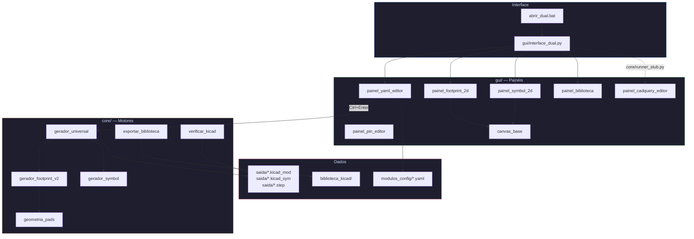

# 🏭 EDA Footprint Generator

> Gerador paramétrico de **footprints** (`.kicad_mod`), **símbolos esquemáticos** (`.kicad_sym`) e **modelos 3D STEP** para o KiCad — tudo a partir de arquivos YAML.

---

## 📋 Visão Geral

A **EDA Footprint Generator** é uma aplicação desktop construída sobre o
[CQ-Editor](https://github.com/CadQuery/CQ-editor) (PyQt5 + CadQuery) que permite
projetar componentes eletrônicos de forma declarativa.

Em vez de desenhar manualmente cada pad, silk e courtyard, você descreve o
componente em um arquivo **YAML** com parâmetros físicos (dimensões do corpo,
espaçamento de pinos, tipo de encapsulamento) e a plataforma gera
automaticamente:

| Artefato | Formato | Descrição |
|---|---|---|
| Footprint | `.kicad_mod` | Layout de pads, silkscreen, courtyard e camadas fab |
| Símbolo | `.kicad_sym` | Representação esquemática com pinos nomeados e tipados |
| Modelo 3D | `.step` | Sólido paramétrico gerado via CadQuery / OpenCASCADE |

A interface gráfica oferece preview **2D interativo** (footprint + símbolo) e
**3D em tempo real** (via motor CQ-Editor), tudo em uma janela unificada com
tema escuro Catppuccin Mocha.

---

## 🧩 Tipos de Componente Suportados

| Tipo | Encapsulamento | Exemplo |
|---|---|---|
| `castellated` | SMD com pads castelados (2 ou 4 lados) | Módulos RF / LTE |
| `diodo_pth` | Axial PTH (DO-41, etc.) | 1N4007 |
| `resistor_pth` | Axial PTH | 470Ω 0.5W |
| `ci_dip` | DIP through-hole | NE555 DIP-8 |
| `ci_soic` | SOIC SMD | NE555 SOIC-8 |
| `conector_pth` | Header / conector PTH | Header 1×3 |
| `led_pth` | LED PTH (3mm / 5mm) | LED 5mm Vermelho |
| `capacitor_pth` | Radial PTH | 100µF 16V |
| `transistor_to92` | TO-92 PTH | BC547 |
| `crystal_hc49` | HC-49 PTH | Cristal 16MHz |

---

## ⚙️ Setup

### Pré-requisitos

| Requisito | Versão mínima |
|---|---|
| Python | 3.10+ |
| KiCad | 6+ (para abrir os arquivos gerados) |
| Sistema Operacional | Windows 10/11 |

### Instalação automática (recomendado)

```powershell
# No PowerShell, a partir da raiz do projeto:
.\scripts\setup_ambiente.ps1
```

O script automaticamente:
1. Detecta o Python instalado (3.10–3.12)
2. Cria o ambiente virtual `.venv`
3. Instala o `ocp` (binário OpenCASCADE)
4. Instala `cadquery` e `CQ-Editor` em modo editável a partir de `libs/`
5. Configura o `KicadModTree` no site-packages

### Instalação manual

```powershell
python -m venv .venv
.\.venv\Scripts\Activate.ps1

pip install PyYAML>=6.0
pip install ocp>=7.7.0
pip install -e libs/cadquery
pip install -e libs/CQ-editor
```

> [!WARNING]
> Não rode `pip install -r requirements.txt` diretamente — o `cadquery` e
> `CQ-Editor` precisam ser instalados a partir das fontes locais em `libs/`.

---

## 🚀 Uso

### Iniciar a plataforma

```bat
abrir_dual.bat
```

### Fluxo de trabalho

```
1. Selecione um componente na aba Biblioteca (ou abra um YAML manualmente)
2. Edite os parâmetros no editor YAML (esquerda)
3. Pressione Ctrl+Enter para gerar footprint + símbolo + modelo 3D
4. Visualize o footprint 2D e o símbolo esquemático nas abas centrais
5. O modelo 3D aparece automaticamente no viewer CQ-Editor (direita)
6. Exporte para a biblioteca KiCad com o botão 📦 Lib
```

### Gerar a biblioteca completa

O botão **📦 Lib** na toolbar gera todos os `.kicad_mod` de `modulos_config/`
e os copia para `biblioteca_kicad/`, organizados por tipo de componente
(uma pasta `.pretty` por tipo).

---

## 📁 Estrutura do Projeto

```
Teste Gerador de footprint/
│
├── abrir_dual.bat             # ▶️  Script de inicialização rápida
├── _estado_atual.json         # Estado interno (último YAML, último output)
│
├── gui/                       # 🖼️  Interface gráfica
│   ├── interface_dual.py          # 🚀 Ponto de entrada principal
│   ├── painel_yaml_editor.py      # Editor YAML com syntax highlighting
│   ├── painel_footprint_2d.py     # Viewer 2D interativo do footprint
│   ├── painel_symbol_2d.py        # Viewer 2D do símbolo esquemático
│   ├── painel_cadquery_editor.py  # Editor de código CadQuery (modelo 3D)
│   ├── painel_pin_editor.py       # Editor visual de nomes/tipos dos pinos
│   ├── painel_biblioteca.py       # Navegador da biblioteca de componentes
│   ├── canvas_base.py             # Canvas matplotlib interativo (zoom, pan)
│   └── widgets_common.py          # Widgets compartilhados (toolbar, status)
│
├── core/                      # ⚙️  Motores de geração
│   ├── runner_stub.py             # 🔌 Loader CQ-Editor — ponte para o motor 3D
│   ├── gerador_footprint_v2.py    # Gera .kicad_mod (7 padrões + shim tipo→padrao)
│   ├── footprint_helpers.py       # Helpers compartilhados (pads, silk, courtyard)
│   ├── gerador_symbol.py          # Gera .kicad_sym (símbolo esquemático)
│   ├── gerador_universal.py       # Orquestrador: YAML → footprint + sym + 3D
│   ├── geometria_pads.py          # Cálculo de geometria dos pads
│   ├── exportar_biblioteca.py     # Exportação em lote para biblioteca KiCad
│   ├── verificador_drc.py         # DRC: regras do YAML (estimativa) + geometria real do .kicad_mod (silk sobre pad, colisão)
│   ├── verificador_modelo_3d.py   # Confere que o modelo .step referenciado existe
│   ├── conferir_footprint.py      # Confere colisão de pads, gabarito e símbolo × footprint
│   ├── verificar_kicad.py         # Valida os .kicad_mod gerados contra as specs do KiCad
│   └── log_config.py              # Configuração de logging
│
├── modulos_config/            # 📝 Configurações YAML dos componentes
│   ├── _template.yaml            # Template base para novos componentes
│   ├── resistor_470R.yaml
│   ├── 1N4007_DO41.yaml
│   ├── NE555_DIP8.yaml
│   ├── NE555_SOIC8.yaml
│   ├── LED_5mm_Vermelho.yaml
│   ├── Cap_100uF_16V.yaml
│   ├── BC547_TO92.yaml
│   ├── Crystal_16MHz_HC49.yaml
│   ├── header_3pin.yaml
│   ├── ModuloLTE_4Lados.yaml
│   └── ...
│
├── saida/                     # 📤 Arquivos gerados (footprint + sym + STEP)
│
├── biblioteca_kicad/          # 📚 Biblioteca KiCad exportada
│   ├── castellated.pretty/
│   ├── ci_dip.pretty/
│   ├── ci_soic.pretty/
│   ├── resistor_pth.pretty/
│   └── ...  (uma pasta .pretty por tipo)
│
├── libs/                      # 📦 Dependências locais
│   ├── CQ-editor/                # Fork/cópia do CQ-Editor
│   ├── cadquery/                 # CadQuery (kernel CAD paramétrico)
│   ├── kicad-footprint-generator/ # Utilitários KiCad
│   └── kicad-library-utils/      # Validação de bibliotecas KiCad
│
├── KicadModTree_dev/          # 🌳 Gerador de S-expressions KiCad
│
├── tests/                     # 🧪 Testes
│   └── teste_v2.py            # Suite de testes (107 testes)
│
├── docs/                      # 📖 Documentação
│   └── MANUAL_YAML_REFERENCIA.yaml  # Referência completa dos campos YAML
│
└── scripts/
    └── setup_ambiente.ps1     # 🔧 Setup automático do ambiente
```

---

## 🏗️ Arquitetura



---

## 📄 Formato YAML

Cada componente é descrito por um arquivo YAML em `modulos_config/`.
Abaixo, um exemplo de resistor PTH axial:

```yaml
# Resistor 470Ω PTH axial — pacote 0.5W
nome: "R_Axial_470R"
tipo: "resistor_pth"

corpo:
  comprimento: 6.0
  diametro: 2.5

pinos:
  espacamento: 10.16
  diametro_pad: 1.8
  diametro_furo: 0.8

kicad:
  referencia: "R?"
  valor: "470R"
  descricao: "Resistor 470R 0.5W PTH axial"
  tags: "resistor pth axial 470r"
  modelo_3d: "R_Axial_470R.step"

margens:
  courtyard: 0.5
  silkscreen: 0.12
  fab_line: 0.10
```

### Campos principais

| Campo | Descrição |
|---|---|
| `nome` | Nome do componente (usado como nome do arquivo de saída) |
| `tipo` | Tipo de encapsulamento (ver tabela de tipos acima) |
| `corpo` | Dimensões físicas do corpo (variam por tipo) |
| `pinos` | Configuração de pinos: pitch, diâmetro, furos, lados (castellated) |
| `pinos.overrides` | Sobreposições de tamanho para pinos específicos (ex: VCC/GND maiores) |
| `pinos.lados` | Distribuição de pinos por lado — para castellated 4 lados |
| `pcb` | Dimensões da PCB do módulo (apenas castellated) |
| `kicad` | Metadados KiCad: referência, valor, descrição, tags, caminho do 3D |
| `margens` | Courtyard, silkscreen e fab line widths |
| `modelo_3d_python` | Código CadQuery inline para modelo 3D customizado (opcional) |

> [!TIP]
> Use o arquivo `modulos_config/_template.yaml` como ponto de partida para
> novos componentes — ele contém todos os campos documentados.

---

## ⌨️ Atalhos de Teclado

| Atalho | Ação |
|---|---|
| `Ctrl+Enter` | 🔄 Gerar footprint + símbolo + modelo 3D |
| `F5` | 🔄 Gerar (alternativo, redireciona para o fluxo completo) |
| `Ctrl+S` | 💾 Salvar YAML |
| `Ctrl+N` | ✨ Novo componente (a partir do template) |
| `Ctrl+D` | 📋 Duplicar componente atual |
| `Ctrl+P` | 📌 Abrir editor de pinagem |
| `Ctrl+Q` | 🔧 Abrir/editar código CadQuery do modelo 3D |
| `Ctrl+Shift+V` | 🔬 Verificar footprints (validação DRC) |
| `Ctrl+Z` | ↩ Desfazer |
| `Ctrl+Y` | ↪ Refazer |
| `Home` | 🏠 Ajustar visualização (fit to view) |
| `+` / `-` | 🔍 Zoom in / Zoom out (nos viewers 2D) |
| `←` `→` `↑` `↓` | 🧭 Pan (navegação nos viewers 2D) |
| `Scroll` | 🔍 Zoom centrado no cursor |

---

## Licença

Este projeto é distribuído sob a **GNU General Public License v3.0** (GPL-3.0-or-later).

Veja o arquivo [LICENSE](LICENSE) para detalhes completos e [NOTICE](NOTICE) para atribuições de terceiros.

---

<p align="center">
  <sub>Construído com 💜 usando PyQt5 · CadQuery · KicadModTree</sub>
</p>
